# 🌐 AWS 3-Tier Architecture Using Terraform  
A complete, production-ready 3-tier cloud infrastructure built with **Terraform on AWS**, including:

- 🟦 **Public tier** → Frontend EC2  
- 🟩 **Private tier** → Backend EC2  
- 🟨 **Data tier** → RDS MySQL (private)  

This project demonstrates industry-standard cloud architecture, infrastructure automation, and secure network design.

---

# 📸 Architecture Overview

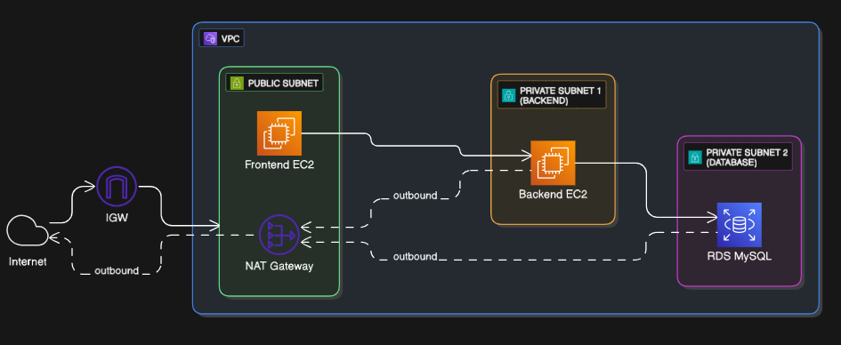

```
Frontend (Public Subnet) → Backend (Private Subnet) → Database (Private Subnet)
                ↑ Internet Gateway ←→ NAT Gateway ←
```

---

# 🚀 **What We Built**

Here is everything we deployed using Terraform:

---

## 🏗️ **1. VPC (Virtual Private Cloud)**  
Resource: `aws_vpc.my-vpc`  

Your entire cloud network — a secure boundary for frontend, backend, and database tiers.

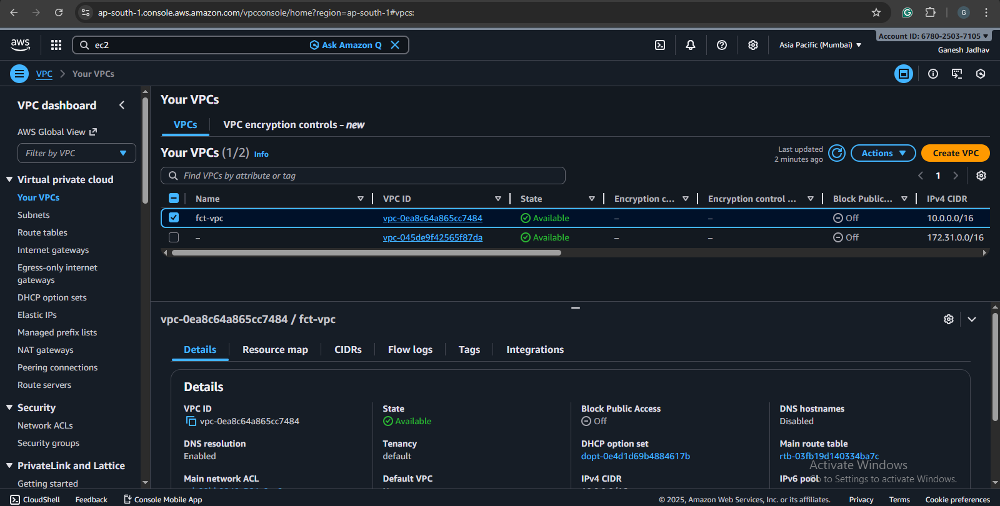

---

## 🧱 **2. Subnets**

### 🟦 Public Subnet → Frontend  
Resource: `aws_subnet.pub-sub`  
Used to host the frontend EC2 that needs internet access.

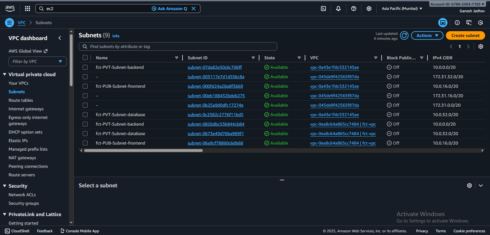

### 🟩 Private Subnet 1 → Backend  
Resource: `aws_subnet.pvt-sub1`  
Backend EC2 is isolated and reachable only from the frontend.


### 🟨 Private Subnet 2 → Database  
Resource: `aws_subnet.pvt-sub2`  
RDS stays private—cannot be accessed from internet.


---

## 🔌 **3. Internet Gateway (IGW)**  
Resource: `aws_internet_gateway.my-igw`

Allows internet traffic for public resources.

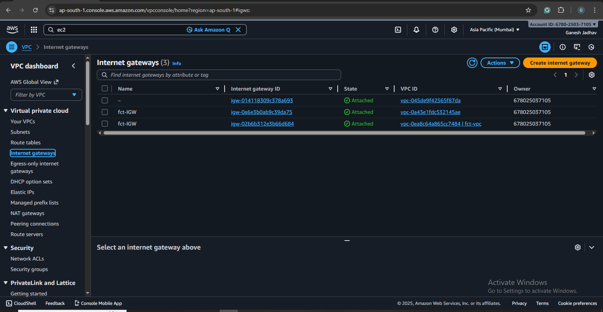

---

## 🌐 **4. NAT Gateway + Elastic IP**  
Resources:
- `aws_eip.nat_eip`
- `aws_nat_gateway.natgw`

Enables private subnets (backend) to access the internet **outbound only** (apt/yum updates), while staying unreachable from outside.

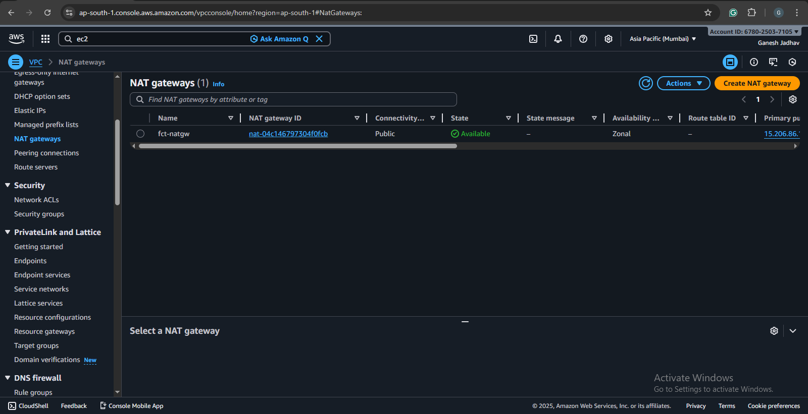

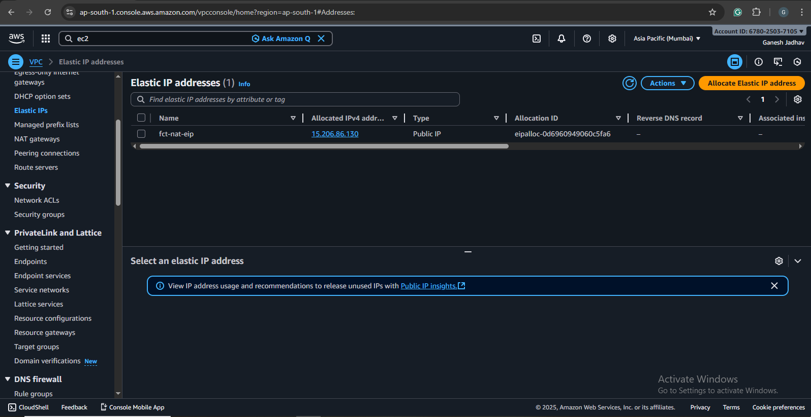
---

## 🛣️ **5. Route Tables**

### Public Route Table  
Resource: `aws_default_route_table.main-rt`  
Routes → **Internet Gateway**

### Private Route Table  
Resource: `aws_route_table.private_rt`  
Routes → **NAT Gateway**

Subnet associations ensure traffic flows correctly.

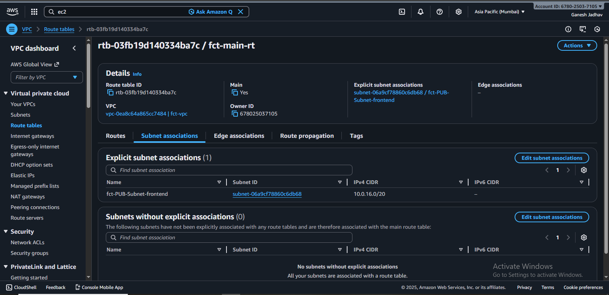

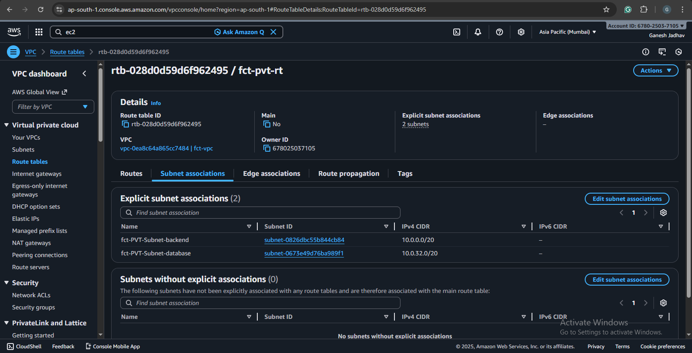

---

## 🔐 **6. Security Groups**

### 🔵 Frontend SG  
Allows HTTP (80) + SSH (22) from anywhere.

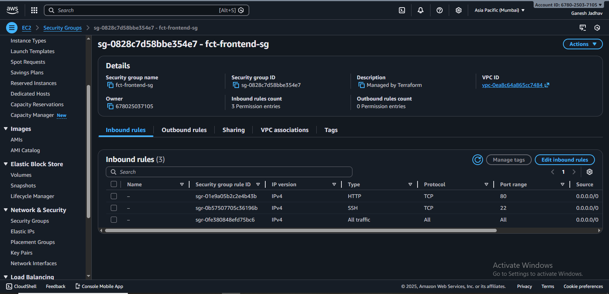

### 🟢 Backend SG  
Allows app traffic **only from frontend** SG.

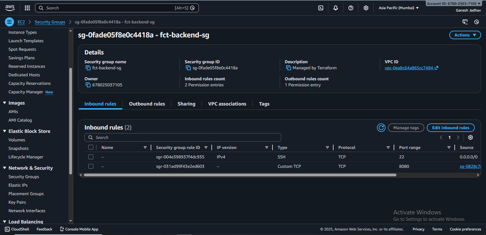

### 🟡 Database SG  
Allows MySQL traffic **only from backend** SG.

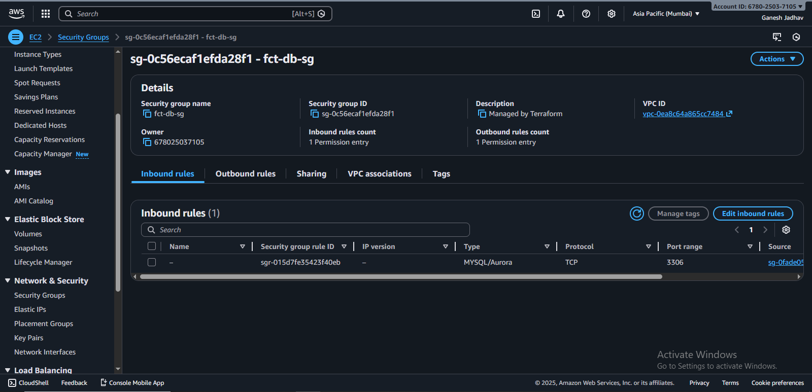

---

## 💻 **7. EC2 Instances**

### 🟦 Frontend EC2 (Public)  
Resource: `aws_instance.frontend`  
Has public IP + accessible over HTTP.

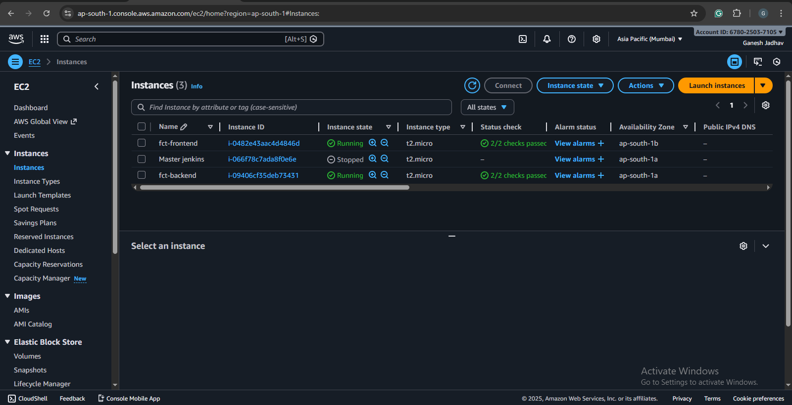

### 🟩 Backend EC2 (Private)  
Resource: `aws_instance.backend`  
Only frontend communicates with backend.


---

## 🗄️ **8. RDS MySQL Database**

Resources:
- `aws_db_subnet_group.db-subnet`
- `aws_db_instance.mydb`

Private database with no public exposure.


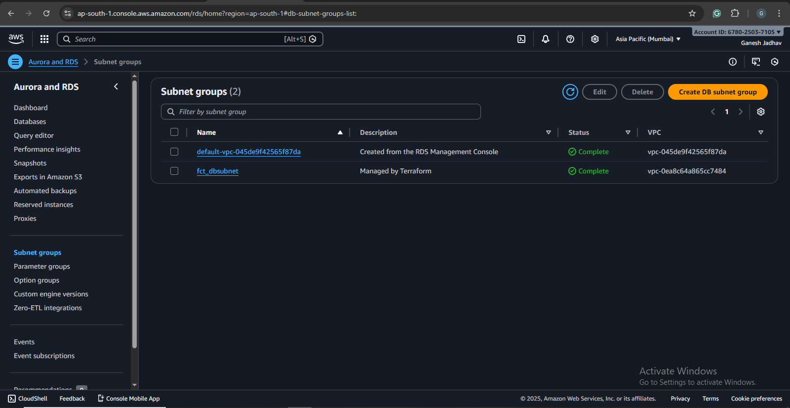

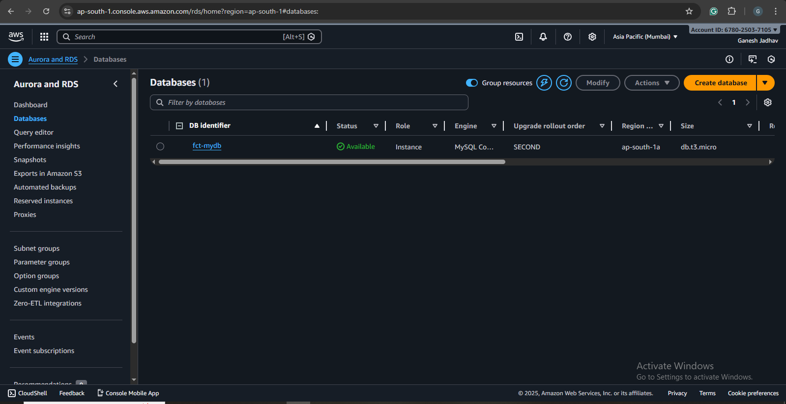


---

# 🎓 **What We Learned (Very Important for GitHub & Interviews)**

This project helped us understand:

---

## 🧠 **1. Core AWS Networking**
- How VPC works  
- How subnets isolate workloads  
- Public vs Private subnet usage  
- CIDR planning & IP allocation  

---

## 🌉 **2. Internet Gateways vs NAT Gateways**
| Component | Direction | Used By |
|----------|-----------|---------|
| IGW | Inbound + Outbound Internet | Public resources |
| NAT Gateway | Outbound Only | Private resources |

This is **one of the biggest real-world AWS concepts**.

---

## 🛡️ **3. Security Groups**
- Principle of least privilege  
- Layer-by-layer protection  
- Allowing traffic with **security group references** instead of CIDR  

Example: Backend SG only allows traffic from Frontend SG → very secure.

---

## 🧩 **4. Terraform Skills Learned**
- Resource creation  
- Variables and reusability  
- Route tables and associations  
- Dependency management  
- Infrastructure-as-Code best practices  

---

## 🏛️ **5. 3-Tier Architecture Design**
This architecture is used by real companies:

| Tier      | Description |
|-----------|-------------|
| Frontend  | Handles UI and receives public traffic |
| Backend   | Business logic |
| Database  | Stores persistent data |

You now know how to deploy all **3 layers securely**.

---

# 📁 Project Structure

```
├── main.tf
├── variables.tf
├── terraform.tfvars
├── README.md
└── images/
     ├── vpc.png
     ├── public-subnet.png
     ├── private-backend.png
     ├── private-db.png
     ├── frontend-sg.png
     ├── backend-sg.png
     ├── db-sg.png
     ├── natgw.png
     ├── igw.png
     ├── rds.png
     └── architecture.png
```

---

# ⚙️ Deployment Guide

### 1️⃣ Initialize Terraform
```bash
terraform init
```

### 2️⃣ Validate
```bash
terraform validate
```

### 3️⃣ Plan
```bash
terraform plan
```

### 4️⃣ Apply
```bash
terraform apply -auto-approve
```

### 5️⃣ Destroy (Cleanup)
```bash
terraform destroy -auto-approve
```

---

# ⭐ Final Thoughts

This project is a **complete, real-world cloud deployment**.  
You now understand:

- How enterprises design secure multi-tier apps  
- How Terraform automates AWS cloud infrastructure  
- How to build robust, scalable architectures  

This repository is a perfect **portfolio project** for Cloud, DevOps, and AWS roles.

---

# 👨‍💻 Author  
**Ganesh Jadhav — Cloud & DevOps Engineer**

